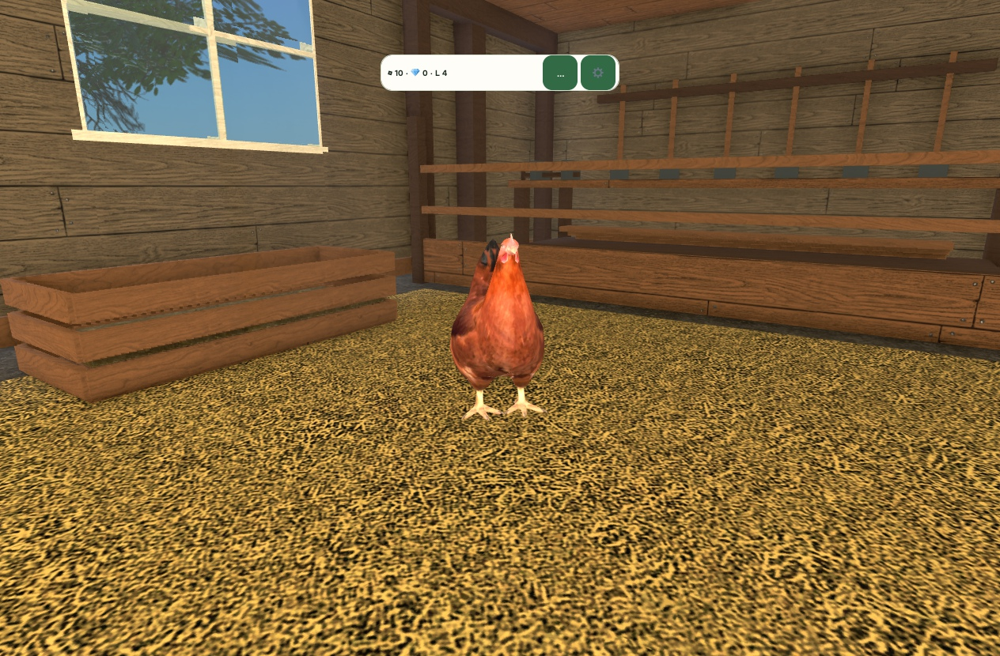
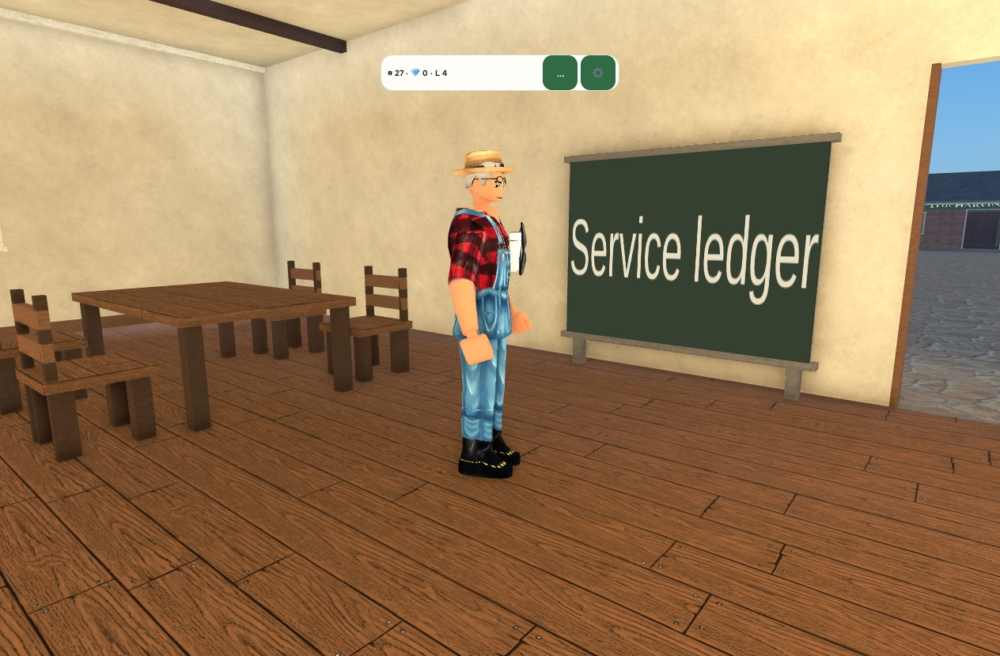

# Farm Tycoon Capture Gallery

Public gallery of 51 genuine reviewed captures. Newest dated evidence appears first using validated receipt timestamps, with unavailable dates last. Every image has a SHA-256 entry in [the public inventory](capture-inventory.json).

The newest additions show the current earned chicken and the restaurant NPC after a real 60-second service. Separate private input receipts record normal construction, feed production, chicken feeding, egg collection and the first restaurant order. The images themselves show development states, not proof of durable saving or final art. The restaurant counter and furniture remain unfinished.

This static documentation gallery is not a playable game or substitute. Private source, place files, profile receipts, account avatars, editor surfaces and machine paths are excluded. Captions preserve the limits of each observation. Published startup, live save/rejoin, complete catalogue coverage and device performance remain unverified.

Deployment `35634819420` of `2d2d8c2` succeeded. Independent live readback returned HTTP 200 for the page, the 51-entry inventory, and every image. All 51 downloaded image hashes match their original inventory values. [Delivery receipt](evidence/gallery-51-live.json). The existing date-order implementation remains unchanged; this update did not repeat browser interaction acceptance.
