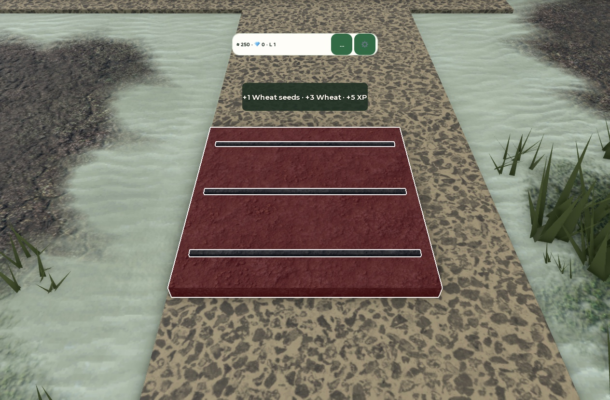
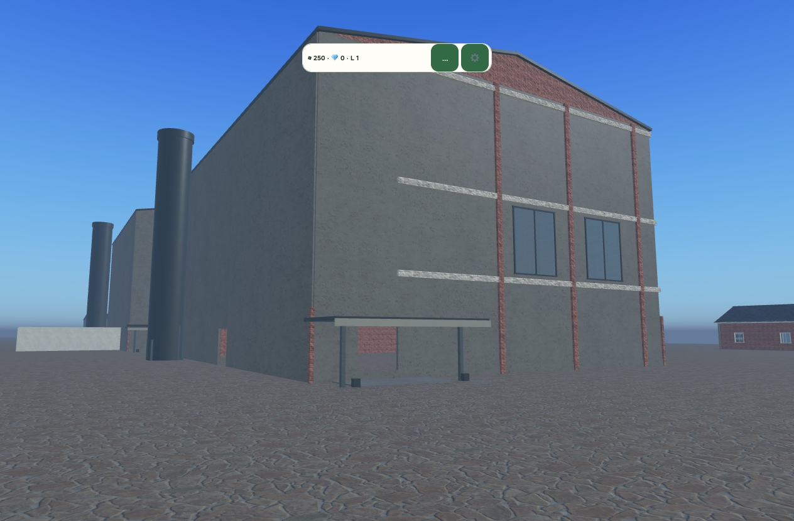
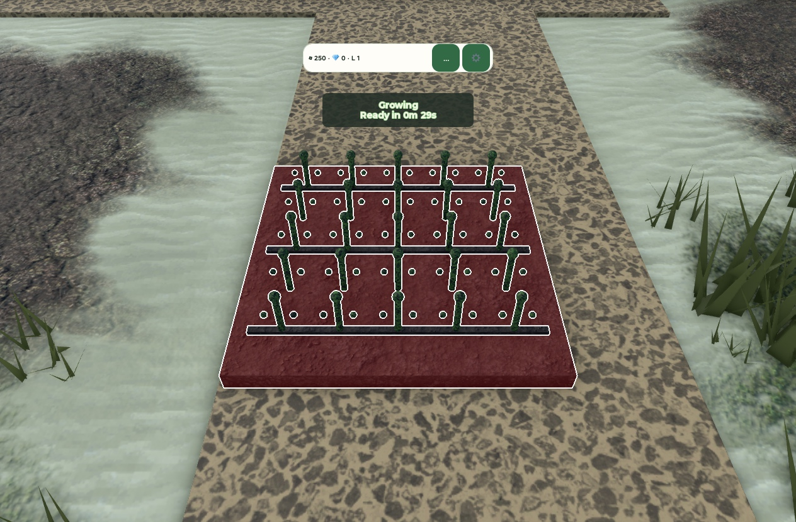

# Farm Tycoon Capture Gallery

Current update:80 reviewed original images, newest first. The latest three show isolated silo grounds, constructed destination status and a physical inspection readout. All80 local hashes match, and prior77 images retain their bytes. Public deployment35773336953 succeeded; the live page, inventory and all80 image hashes match f0c83f1. Artwork remains provisional.

Current update: 77 reviewed original images, newest first. The three additions show the supported perimeter, constructed silo courtyard and readable physical Claim panel. Deployment35703493568 succeeded. Unauthenticated readback matched the exact page, inventory and all77 original image hashes; all74 previous images are preserved. See evidence/gallery-77-live.json. Browser interaction was not repeated. Final landscape and architecture realism remain unfinished.

## September 22 update

The gallery now contains 74 reviewed original captures. Five additions show the standalone crop silo, its physical inspection panel and separate ledger, the real wheat timer and harvest reward. Validated receipt timestamps place the inspection panel first. The original 69 identities and bytes are preserved. No private source, profile records, account imagery or machine paths were copied. Deployment 35688537129 succeeded. The public page, 74-entry inventory and all 74 image hashes were verified through unauthenticated HTTP readback. The inspection panel is first. See [delivery evidence](evidence/gallery-74-live.json). Browser interaction was not repeated.

## Earlier batches

The previous gallery contained 69 genuine reviewed captures. Newest dated evidence appears first using validated receipt timestamps, with unavailable dates last. Every image has a SHA-256 entry in [the public inventory](capture-inventory.json).

The newest additions show an owned feedmill silo and actual crop planting, growth, harvest and reward states. The silo is a basic design without a separate grain inventory. The first-run grain-head discrepancy remains unresolved. Authoring and diagnostic fixtures are labelled separately from actual input, while earlier missing-feedback and plain-facade images remain explicitly labelled before-fix observations. The previous batch shows the earned chicken and restaurant NPC after a real 60-second service. The images themselves show development states, not proof of durable saving or final art. The restaurant counter and furniture remain unfinished.

This static documentation gallery is not a playable game or substitute. Private source, place files, profile receipts, account avatars, editor surfaces and machine paths are excluded. Captions preserve the limits of each observation. Published startup, live save/rejoin, complete catalogue coverage and device performance remain unverified.

Deployment `35634819420` of `2d2d8c2` succeeded. Independent live readback returned HTTP 200 for the page, the 51-entry inventory, and every image. All 51 downloaded image hashes match their original inventory values. [Delivery receipt](evidence/gallery-51-live.json). The existing date-order implementation remains unchanged; this update did not repeat browser interaction acceptance.

The 59-image update deployed successfully in35639772331 at source8ea064d. Independent unauthenticated readback returned HTTP200 for the page, inventory and all59 images; every SHA-256 matched. [Current delivery receipt](evidence/gallery-59-live.json). The earlier51-image receipt remains historical evidence. Diagnostic probes, verbose planting views pending readability review, and duplicate reward framing are excluded with reasons in the inventory.

The current crop and silo update adds ten reviewed original images, with `owned-feedmill-silo` newest by validated capture time. The silo is presented as a basic design without a separate grain inventory. The first-run grain-head discrepancy remains unresolved. Authoring and diagnostic fixtures are labelled separately from actual input. Deployment and live readback evidence for the 69-image state is recorded in [the current delivery receipt](evidence/gallery-69-live.json).
